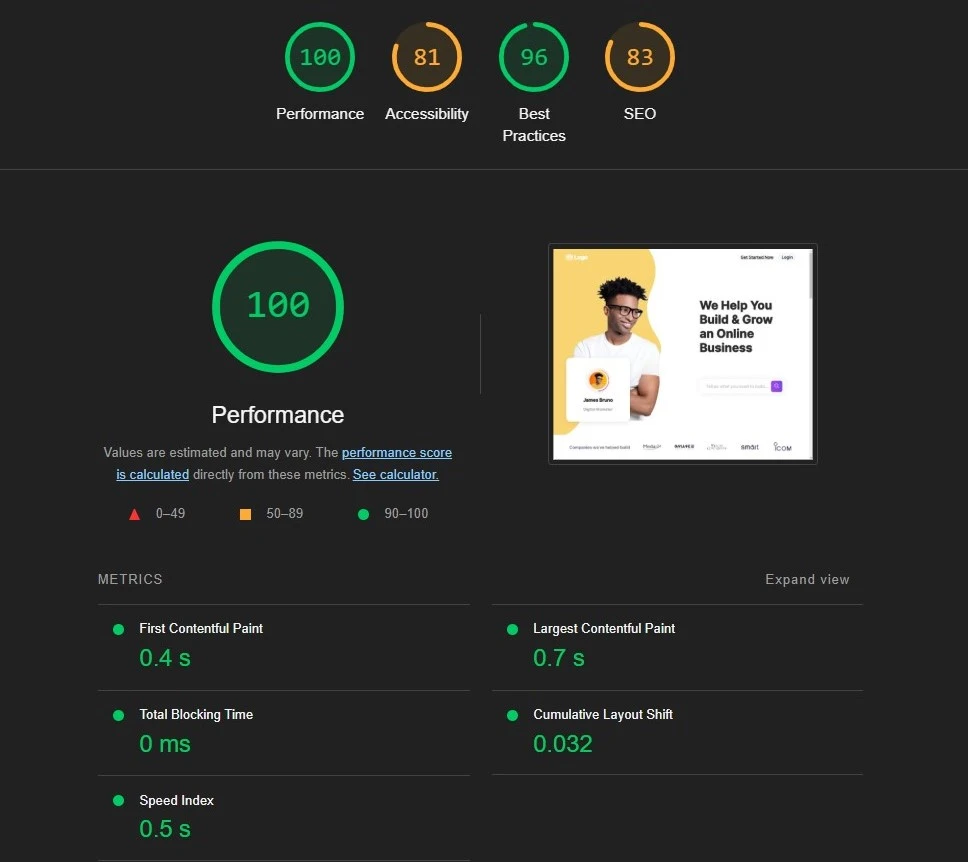

<h1 align="center">🏝️ 📃 Landing Page</h1>

<div align="center">
  
  [**🌐 View Live Demo**](https://amr-elshabrawy-dev.github.io/landing-page/){:target="_blank"} | [**📦 GitHub Repo**](https://github.com/Amr-Elshabrawy-Dev/landing-page){:target="_blank"}

  

Welcome to the **🏝️ 📃 Landing Page** project! This project is a fully responsive and visually appealing landing page designed to showcase a modern and interactive user experience. Built using **🚀React** with **⚡Vite** as the build tool, this project utilizes best practices in front-end development to deliver high performance and maintainable code.
  
</div>

## ✨ Features

- **🎨 Modern UI/UX**: Contemporary design with intuitive user interface elements.
- **⚡ Fast Loading**: Optimized code and assets for quick page loads.
- **🎯 Interactive Elements**: Engaging hover effects and click animations.
- **🧹 Clean Code**: Well-structured and maintainable React components.
- **🔍 SEO Ready**: Built with search engine optimization in mind.
- **📱 Responsive Design**: Optimized for all devices, including mobile, tablet, and desktop.
- **⚡ Performance Optimization**: Leveraged techniques such as lazy loading and optimized assets for better performance.
- **✨ Dynamic Animations**: Smooth animations for improved user interactivity.
- **🖼️ Image Optimization**: Reduced image sizes using `vite-plugin-image-optimizer` to enhance load speed.
- **♿ Accessibility**: Ensured accessibility standards with semantic HTML and ARIA roles.

## 🛠️ Core Technologies

- 🚀 [**React**](https://reactjs.org/){:target="_blank"}: Modern front-end framework for building user interfaces
- ⚡ [**Vite**](https://vitejs.dev/){:target="_blank"}: Lightning-fast build tool and development server
- 🔀 [**React Router**](https://reactrouter.com/){:target="_blank"}: Dynamic routing management
- 💎 [**React Icons**](https://react-icons.github.io/react-icons/){:target="_blank"}: Rich icon library integration
- 🖼️ [**vite-plugin-image-optimizer**](https://github.com/FatehAK/vite-plugin-image-optimizer){:target="_blank"}: Automatic image optimization
- 📊 [**vite-plugin-svgr**](https://github.com/pd4d10/vite-plugin-svgr){:target="_blank"}: SVG handling and optimization
- 🔍 [**ESLint**](https://eslint.org/){:target="_blank"}: Code quality and style enforcement
- 🎯 **Lighthouse**: Performance and SEO analysis tool

### 🛠️ Development Stack

- 🎨 **CSS**: Custom styling with responsive animations
- 📱 **Media Queries**: Responsive design implementation
- 🗜️ **Asset Optimization**: Image and resource compression
- 🌐 **Cross-browser Support**: Consistent experience across platforms

## 🚧 Challenges Faced

### 1. ♿ **Accessibility Enhancement**

- 🎯 Identified gaps in accessibility standards
- ✨ **Solution**: Implemented semantic HTML5 and ARIA roles
- 📈 **Result**: Enhanced experience for users with disabilities

### 2. 🖼️ **Image Performance**

- 📉 Initially faced large image file sizes
- ✨ **Solution**: Integrated `vite-plugin-image-optimizer`
- 📈 **Result**: Significantly reduced image sizes and load times

### 3. 🔍 **Lighthouse Optimization**

- ⚠️ Key issues detected:
  - 🎨 Content painting delays
  - 📦 Resource compression needed
- ✨ **Solutions**:
  - 🔄 Optimized asset loading sequence
  - 🗜️ Implemented Brotli compression
- 📈 **Result**: Improved Lighthouse scores
- 📊 **Lighthouse Score Preview**:
  

### 4. 🎭 **Animation Refinement**

- ⚠️ Intersection Observer issues with animations
- ✨ **Solution**: Enhanced animation logic and hooks
- 📈 **Result**: Smooth, reliable animations

### 5. ⚡ **Performance Tuning**

- ⏳ Initial load time needed improvement
- ✨ **Solution**: Implemented code splitting and lazy loading
- 📈 **Result**: Better FCP and TTI metrics

### 6. 🌐 **Browser Compatibility**

- ⚠️ Inconsistent cross-browser behavior
- ✨ **Solution**: Added normalize css file
- 📈 **Result**: Consistent cross-browser experience

### 7. 📱 **Mobile Experience**

- ⚠️ Suboptimal mobile navigation
- ✨ **Solution**: Redesigned mobile menu system
- 📈 **Result**: Improved mobile usability

## 🔧 Installation

1. 📥 Clone the repository:

   ```bash
   git clone https://github.com/your-username/landing-page.git
   ```

1. 📂 Navigate to the project directory:

   ```bash
   cd landing-page
   ```

1. ⚙️ Install dependencies:

   ```bash
   npm install
   ```

1. 🚀 Run the development server:

   ```bash
   npm run dev
   ```

1. 🏗️ Build the project for production

   ```bash
   npm run build
   ```

## 🔮 Future Improvements

- 🔍 Enhance SEO by adding meta tags and schema markup.
- 🧪 Implement testing with Jest and React Testing Library.
- 🌓 Add dark/light theme support with user preference persistence.
- 📝 Add a blog section with content management system integration.
- 📬 Create a feedback/contact form with email integration.
- 📊 Integrate analytics to track user engagement and behavior.
- 📱 Implement progressive web app (PWA) features for offline access.

---

## 📚 Acquired Knowledge

- 🎨 **UI/UX Best Practices**: Gained deep understanding of modern interface design
- 🔧 **Performance Optimization**: Mastered techniques for improving load times and resource management
- 📱 **Responsive Design**: Enhanced skills in creating adaptable layouts
- 🔍 **SEO Fundamentals**: Learned key aspects of search engine optimization
- ⚡ **Vite Configuration**: Advanced knowledge of build tool customization
- 🖼️ **Image Optimization**: Expertise in reducing asset sizes while maintaining quality
- 🎭 **Animation Implementation**: Improved understanding of performant CSS animations
- ♿ **Accessibility Standards**: Learned WCAG guidelines and implementation

---

## 🌐 Let's Connect

<div align="center">
  
[](https://github.com/Amr-Elshabrawy-Dev){:target="_blank"} [](https://wa.me/201202546653?text=Hi%20Amr!%20I%20saw%20your%20portfolio%20and%20would%20love%20to%20discuss%20a%20potential%20collaboration){:target="_blank"} [](https://github.com/Amr-Elshabrawy-Dev){:target="_blank"} [](https://www.linkedin.com/in/amr-elshabrawy-dev){:target="_blank"} [](mailto:amrelshabrawy.dev@gmail.com){:target="_blank"} [](https://www.x.com/@AmrElshabr43803){:target="_blank"}

</div>

---

  <div align="center">
    <h1 style="font-size: 2.5rem; color: #2ea44f;">👨‍💻 AMR ELSHABRAWY</h1>
      
      <p style="color: #586069; font-size: 1.1rem; margin-top: 1rem;">
        Created with 💚 by <strong><a href="https://github.com/Amr-Elshabrawy-Dev">AMR ELSHABRAWY</a></strong> 🌟 &copy; 2025
      </p>
      <hr style="width: 100%; margin: 2rem auto; border: 0; border-top: 4px solid #e1e4e8;">
  </div>
